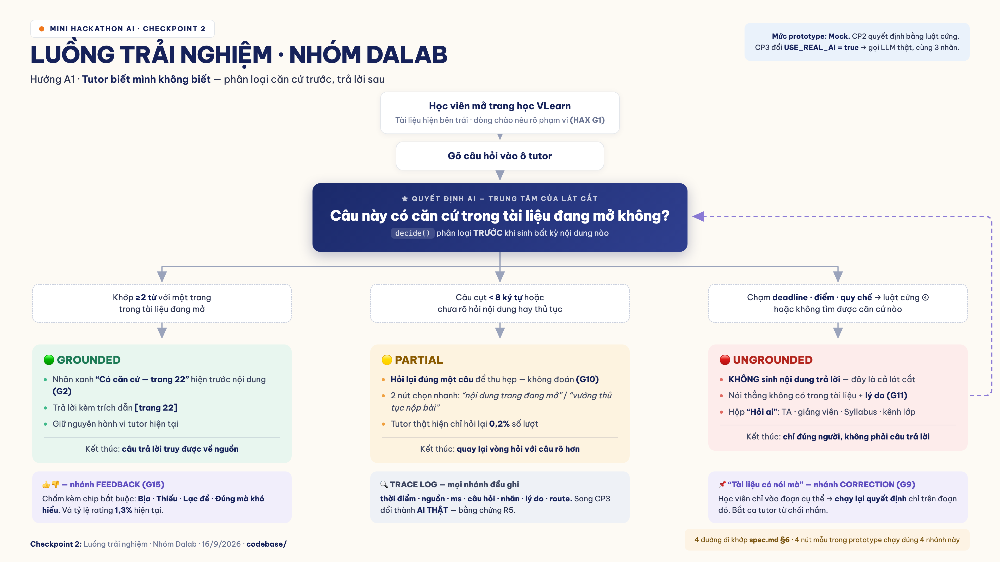

# Prototype — "Tutor biết mình không biết"

**Mức prototype:** Mock (spec.md §4) · **Phụ trách:** ĐOÀN DUY BÁCH (code) · NGUYỄN VĂN SƠN (UX)

## Chạy

```bash
cd codebase && python3 -m http.server 8777
# mở http://localhost:8777
```
Dùng ES modules nên **phải chạy qua http server**, mở thẳng `file://` sẽ lỗi CORS.

## Tệp

| Tệp | Vai trò |
|---|---|
| `tutor-core.js` | **Quyết định trung tâm** — phân loại GROUNDED 🟢 / PARTIAL 🟡 / UNGROUNDED 🔴 trước khi trả lời |
| `fixtures.js` | Tài liệu fixture (trích ngắn slide D01) + bảng định tuyến + 4 câu mẫu |
| `index.html` | Giao diện mô phỏng khung tutor trong trang học VLearn |

## Thật / mock — khai báo trung thực

| Phần | Trạng thái |
|---|---|
| Quyết định phân loại có/không có căn cứ | 🟡 **CP2: mock bằng luật cứng** (`mockDecide`) → 🟢 **CP3: `aiDecide` gọi Gemini thật** |
| Nội dung tài liệu đang mở | 🟡 Fixture — 3 trang trích từ slide D01 trong data pack |
| Bảng "hỏi ai cho phần này" | 🟡 Mock — 4 dòng cứng |
| Giao diện trang học | 🟡 Mock tĩnh |

## Bật AI thật tại CP3

Sửa đúng một dòng trong `tutor-core.js`:
```js
export const CONFIG = { USE_REAL_AI: true, model: "gemini-2.0-flash" };
```
`aiDecide()` đã viết sẵn prompt kèm **luật cứng lớp ④** (deadline / chấm điểm / điểm cá nhân / thao tác hệ thống → luôn UNGROUNDED, không để mô hình tự quyết). Hàm `logTrace()` ghi prompt + response thô để nộp bằng chứng R5.

> ⚠️ **Không commit API key.** Key truyền vào qua biến môi trường hoặc ô nhập tạm trong phiên demo.

## Sơ đồ luồng



Nguồn render: `docs/cp2-flow.html` · ảnh: `docs/cp2-flow.png`

## 4 đường đi trải nghiệm — bấm thử

| Nút mẫu | Đường đi (spec.md §6) | Kết quả mong đợi |
|---|---|---|
| 🟢 Happy path | Có căn cứ | Trả lời + trích dẫn `[trang N]` |
| 🟡 Low-confidence | Câu hỏi mơ hồ ("hi") | Hỏi lại **một câu** để thu hẹp, không đoán |
| 🔴 Không căn cứ | `T04628` — commit sau deadline | **Không sinh nội dung** + chỉ hỏi TA |
| 🔴 Ngoài thẩm quyền | Xin xem điểm cá nhân | Từ chối + nêu lý do thẩm quyền |

Nút **"📌 Tài liệu có nói mà"** = đường **correction** (HAX G9).
